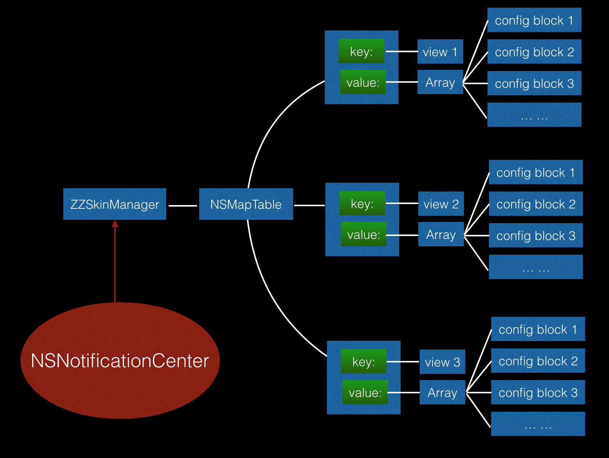

# ZZSkin
Test git checkout -b
自始至终都是你，让我投入太彻底
**主题更换**

#### 需求: 项目中需要做到主题更换，比如黑夜/白天切换

#### 效果图


####思路
以前也写过一个iOS主题更换的小库[ZZTheme](https://github.com/ACommonChinese/ZZTheme)，但API有些多，现在这个思路API相对简单许多，思路如下：  




#### 使用方法

- 把ZZSkin文件夹托入工程
- 在要使用的文件中 `#import "ZZSkinManager.h"`
- 添加代码形如：  

```
self.label.zz_skinConfig(^(UILabel *label) {
	label.textColor = [ZZSkinManager colorWithIdentifier:@"ident1"];
	// ok: label.text = [ZZSkinManager stringWithIdentifier:@"ident1"];
}).zz_skinConfig(^(UILabel *label) {
	label.text = [ZZSkinManager stringWithIdentifier:@"ident1"];
});
```

代码详情参见Demo

注：ZZSkinManager中的以下几个方法：

```
+ (UIColor *)colorWithIdentifier:(NSString *)identifier;
+ (UIImage *)imageWithIdentifier:(NSString *)identifier;
+ (NSString *)stringWithIdentifier:(NSString *)identifier;
```

是从JSON文件（可以从网络上下载下来）中配置的字符串转换成相应对象的方法，因为每个公司的服务器和app交互不确定，因此这几个方法当改写为自己的为好。
